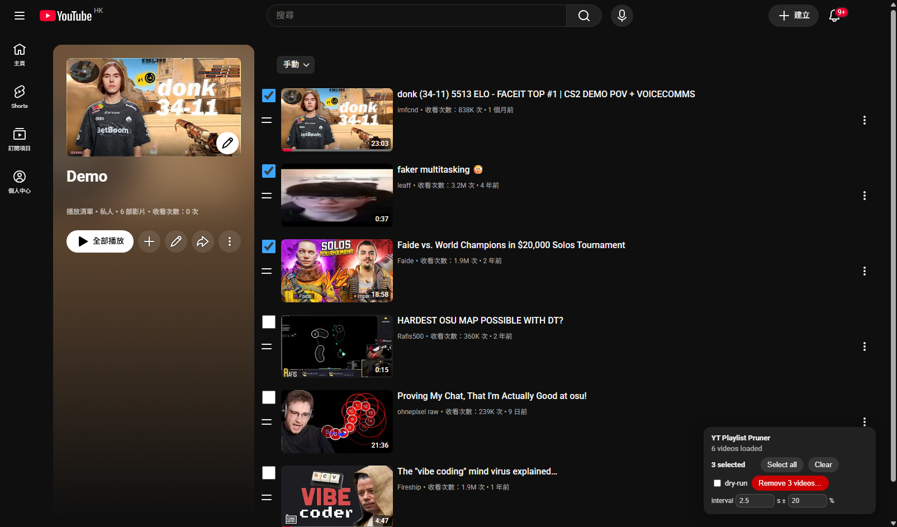
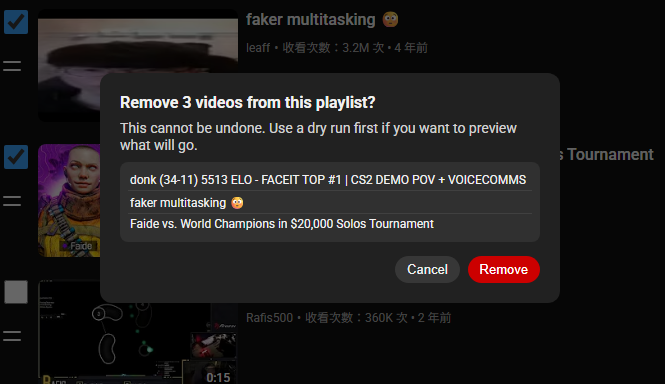
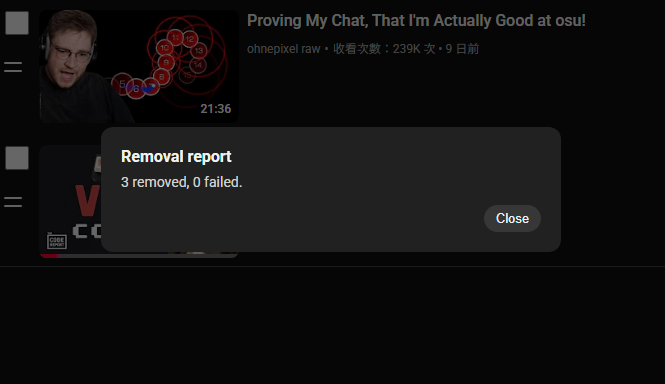

# YT Playlist Pruner

A Chrome extension (MV3, load-unpacked, no store) that adds batch selection to YouTube's own playlist pages: check videos by thumbnail, shift-click ranges, then remove them all in one throttled run. Works on your own playlists and Watch Later.

<p align="center">
  
</p>

## Why

YouTube's UI only removes playlist videos one at a time. The official Data API cannot touch Watch Later at all, and caps writes at 200/day. This extension talks to the same internal API the YouTube page itself uses, from your own signed-in session, so it has neither limit.

## Install

```bash
npm install
npm run build
```

1. Open `chrome://extensions`
2. Enable **Developer mode** (top right)
3. **Load unpacked** → select this folder's `dist/`

## Use

Open any of your playlists (`youtube.com/playlist?list=...`; Watch Later is `?list=WL`). A "YT Playlist Pruner" panel appears bottom-right:

- Click checkboxes to select; **shift-click** to select/deselect a range; **Select all** / **Clear** for everything
- **dry-run** toggle: previews exactly what would go, touches nothing
- **interval** and **± jitter** inputs: seconds between removals (1–10, default 2.5) and the random jitter around each interval in percent (0–50, default 20), both saved per browser, so the pace never reads metronomic unless you want it to
- **Remove N videos…**: confirm dialog, then one removal at a time, driven through the page's own overflow menu at your interval, with progress, ETA, and **Cancel**. The selected rows must be rendered on the page: scroll through the playlist first if it is longer than what has loaded. Failed items are skipped and listed in the end-of-run report; a post-run re-fetch downgrades any removal the server did not actually apply.

<p align="center">
  
</p>

<p align="center">
  
</p>

## How it works

```
youtube.com/playlist?list=…        the real page (thumbnails + titles)
  └─ content script (world: MAIN) reads ytInitialData
     (playlistVideoRenderer), then follows continuation tokens until the
     whole list is loaded (no scrolling); pages that ship an empty initial
     state are instead enumerated via an InnerTube browse call
  └─ checkboxes + toolbar injected into the page
  └─ per selected video, throttled ~2.5 s apart with jitter:
       the script clicks the row's own overflow menu and picks its "Remove"
       action by the item's playlistEditEndpoint data
       (language-independent), then waits for the page to drop the row
```

Removals deliberately drive the page's own menu instead of replaying the `edit_playlist` request: a hand-rebuilt mutation can come back `200` with `loggedOut: true` and silently do nothing, while the page's own click always carries the full session. After a run, the playlist is re-fetched and any claimed removal the server did not apply is downgraded to a failure in the report.

## Risks and limitations

- **Unofficial surface.** The page's menu structure and the InnerTube read shape can change without notice. When removals start failing, the report's reasons name the broken step (menu misses, rows not dropping); reload the page and re-run the failures.
- **ToS.** Automating your own account at human speed for personal pruning is the same thing the many community userscripts do, but it is still outside YouTube's officially supported path. Use at your own judgment.
- **Irreversible.** Removing a video from a playlist cannot be undone. That is what the dry-run toggle is for.
- **Chrome/Edge only**, MV3 `world: "MAIN"` (Chrome 111+). Not tested on Firefox.
- Liked Videos (the new lockup layout) is not supported.

## Development

```bash
npm test        # unit tests (pure logic: parsing, selection, runner, SAPISIDHASH)
npm run typecheck
npm run build   # bundles src/content.ts → dist/content.js
```

Module map — the engine is pure and host-agnostic (no `chrome.*` anywhere), so the same core could later run as a userscript or in another shell. "unit" = covered by the Node test suite; "manual (in-browser)" = exercised by real use against a signed-in YouTube session:

| Module | Role | Tests |
|---|---|---|
| `src/parse-playlist.ts` | recursive walk of ytInitialData / continuation blobs → items + next token | unit |
| `src/selection.ts` | selection state keyed by videoId, shift-range semantics | unit |
| `src/runner.ts` | throttled delete loop, dry-run, per-item failure, auth/rate/user aborts | unit |
| `src/sapisidhash.ts` | SAPISIDHASH Authorization header | unit |
| `src/verify.ts` | post-run reconciliation of removal results against the server | unit |
| `src/settings.ts` | removal-interval and jitter settings, clamped and persisted in localStorage | unit |
| `src/menu-drive.ts` | drives the page's own overflow menu; remove-item predicate | unit + manual |
| `src/innertube.ts` | InnerTube read transport: context from ytcfg, browse + continuations | unit + manual |
| `src/ui.ts`, `src/content.ts` | toolbar, dialogs, row checkboxes, page lifecycle | manual (in-browser) |
